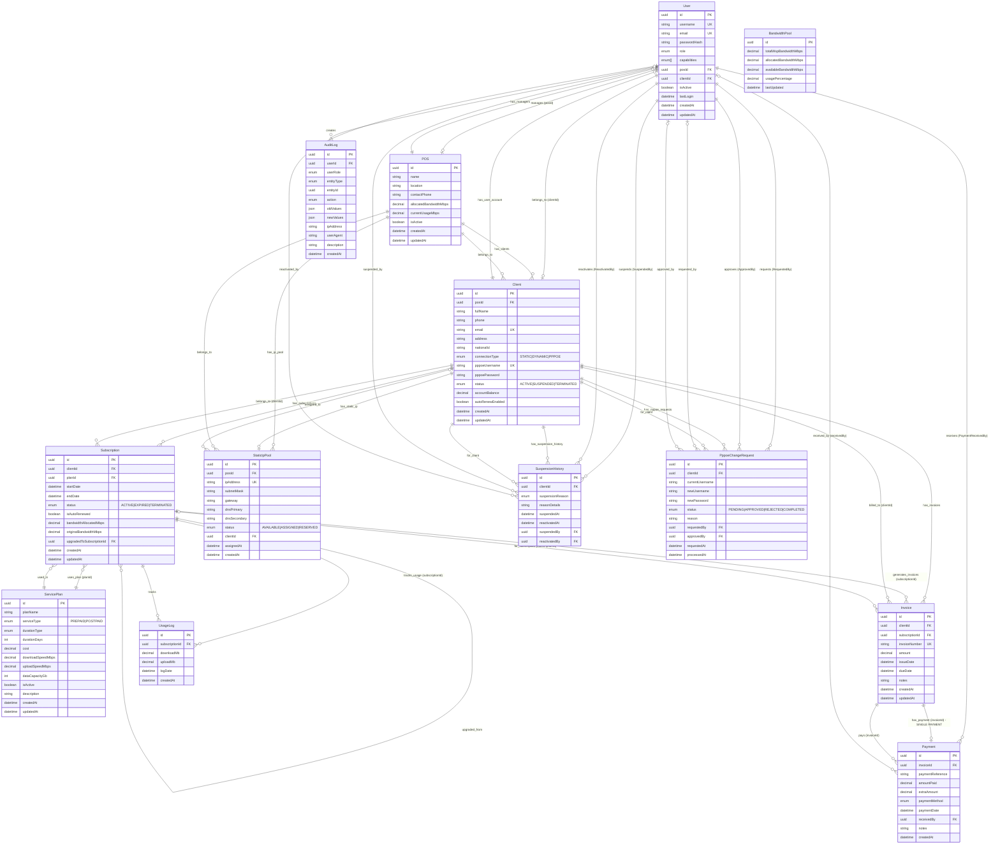

# WSP Backend - Entity Relationship Diagram

## Complete Database Schema



## STATIC/DYNAMIC Client Flow - Key Relationships

### The 5 Critical Relationships That Enable STATIC/DYNAMIC Clients


### Relationship Details

| # | Relationship | From → To | Foreign Key | Cardinality | Purpose |
|---|-------------|-----------|-------------|-------------|---------|
| **1** | Client → Subscription | `Client.id` → `Subscription.clientId` | `clientId` | 1:N | Links client to their subscriptions. Validates connectionType requirements. |
| **2** | Subscription → Invoice | `Subscription.id` → `Invoice.subscriptionId` | `subscriptionId` | 1:N | Auto-generates invoice when subscription created/renewed/upgraded. Invoice notes include connection type. |
| **3** | Invoice → Payment | `Invoice.id` → `Payment.invoiceId` | `invoiceId` | 1:1 | **SINGLE PAYMENT ONLY**. Payment must exactly match invoice amount. Payment activates subscription. |
| **4** | Subscription → UsageLog | `Subscription.id` → `UsageLog.subscriptionId` | `subscriptionId` | 1:N | Tracks usage. Payment-gated (requires paid invoice). Validates connection type and subscription period. |
| **5** | Client → StaticIpPool | `Client.id` → `StaticIpPool.clientId` | `clientId` | 1:0..1 | **STATIC clients only**. Required for STATIC connection type validation. |
| **6** | Client → Invoice (Direct) | `Client.id` → `Invoice.clientId` | `clientId` | 1:N | Direct link for reporting and queries. |

## Key Relationships Summary

### Core Flow: Client → Subscription → Invoice → Payment → Usage

**The relationships that enable STATIC/DYNAMIC clients to have subscriptions, invoices, payments, and usage logs:**

```
1. Client → Subscription
   Relationship: Client.has_subscriptions → Subscription[]
   Foreign Key: Subscription.clientId → Client.id
   Cardinality: One-to-Many (1 Client : Many Subscriptions)
   Note: Validates connectionType requirements (STATIC needs IP, PPPOE needs credentials)

2. Subscription → Invoice
   Relationship: Subscription.generates_invoices → Invoice[]
   Foreign Key: Invoice.subscriptionId → Subscription.id
   Cardinality: One-to-Many (1 Subscription : Many Invoices)
   Note: Auto-generated on subscription create/renew/upgrade
   Invoice notes include: Connection Type (STATIC/DYNAMIC/PPPOE)

3. Invoice → Payment
   Relationship: Invoice.has_payment → Payment
   Foreign Key: Payment.invoiceId → Invoice.id
   Cardinality: One-to-One (1 Invoice : 1 Payment) ⚠️ SINGLE PAYMENT ENFORCED
   Note: Payment amount must exactly match invoice amount
   Payment activates subscription when received

4. Subscription → UsageLog
   Relationship: Subscription.tracks_usage → UsageLog[]
   Foreign Key: UsageLog.subscriptionId → Subscription.id
   Cardinality: One-to-Many (1 Subscription : Many UsageLogs)
   Note: Payment-gated (only works if invoice is paid)
   Validates connection type and subscription period

5. Client → Invoice (Direct)
   Relationship: Client.has_invoices → Invoice[]
   Foreign Key: Invoice.clientId → Client.id
   Cardinality: One-to-Many (1 Client : Many Invoices)
   Note: Direct link for reporting and queries

6. Client → StaticIpPool (STATIC only)
   Relationship: Client.has_static_ip → StaticIpPool
   Foreign Key: StaticIpPool.clientId → Client.id
   Cardinality: One-to-One Optional (1 Client : 0..1 StaticIpPool)
   Note: Required for STATIC connection type
```

### Complete Data Flow Diagram

```
Client (connectionType: STATIC|DYNAMIC|PPPOE)
  │
  ├── [1] has_subscriptions (clientId FK)
  │     └── Subscription
  │         │
  │         ├── [2] generates_invoices (subscriptionId FK)
  │         │     └── Invoice
  │         │         │
  │         │         ├── [3] has_payment (invoiceId FK) - SINGLE PAYMENT
  │         │         │     └── Payment
  │         │         │         └── Activates subscription when paid
  │         │         │
  │         │         └── [5] billed_to (clientId FK) - Direct link
  │         │
  │         └── [4] tracks_usage (subscriptionId FK)
  │               └── UsageLog
  │                   └── Payment-gated & connection type validated
  │
  ├── [6] has_static_ip (clientId FK) - STATIC clients only
  │     └── StaticIpPool
  │
  └── [5] has_invoices (clientId FK) - Direct link for reporting
        └── Invoice[]
```

### Connection Type Support
- **STATIC**: Client → StaticIpPool (1:1)
- **DYNAMIC**: No special requirements
- **PPPOE**: Client has pppoeUsername/password fields

### Financial Flow (STATIC/DYNAMIC Clients)

**The exact relationships that create this flow:**

```
Step 1: Subscription Creation
  Client.id → Subscription.clientId (FK)
  ServicePlan.id → Subscription.planId (FK)
  
Step 2: Invoice Auto-Generation
  Subscription.id → Invoice.subscriptionId (FK)
  Client.id → Invoice.clientId (FK)
  Invoice.notes includes: "Connection Type: STATIC|DYNAMIC|PPPOE"
  
Step 3: Payment Processing
  Invoice.id → Payment.invoiceId (FK)
  User.id → Payment.receivedBy (FK)
  ⚠️ Only ONE payment per invoice allowed
  
Step 4: Service Activation
  Payment received → Subscription.status = ACTIVE
  (Payment service activates subscription)
  
Step 5: Usage Tracking
  Subscription.id → UsageLog.subscriptionId (FK)
  ✅ Validates: Invoice paid, Client not suspended, Within period
```

### Relationship Cardinality Details

| Relationship | From | To | Cardinality | Foreign Key | Notes |
|-------------|------|-----|-------------|-------------|-------|
| Client → Subscription | Client | Subscription | 1:N | `clientId` | Validates connectionType |
| Subscription → Invoice | Subscription | Invoice | 1:N | `subscriptionId` | Auto-generated, includes connection type |
| Invoice → Payment | Invoice | Payment | 1:1 | `invoiceId` | **SINGLE PAYMENT ENFORCED** |
| Subscription → UsageLog | Subscription | UsageLog | 1:N | `subscriptionId` | Payment-gated |
| Client → Invoice | Client | Invoice | 1:N | `clientId` | Direct link for reporting |
| Client → StaticIpPool | Client | StaticIpPool | 1:0..1 | `clientId` | STATIC clients only |

### Subscription Lifecycle
```
Subscription
  ├── can_upgrade_to → Subscription (only after endDate)
  └── can_upgrade_from → Subscription (self-referential)
```

## Business Rules Enforced

1. **Payment-Gated Service**: Usage logs only work if invoice is paid
2. **Single Payment**: Only one payment per invoice (exact amount)
3. **Connection Type Validation**: 
   - STATIC requires static IP
   - PPPOE requires credentials
   - DYNAMIC has no requirements
4. **Upgrade Restriction**: Upgrades only allowed after subscription ends
5. **Auto-Renewal Check**: Renewal requires current invoice to be paid
6. **Suspension Handling**: Usage blocked when client is suspended

